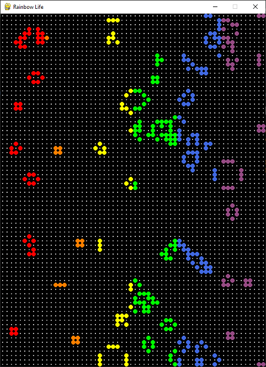

# Rainbow Life
Basic version of Conway's GoL with some interactions and pretty nice looking colors

## Technologies
Project is created with:
* Python 3.9
* PyGame 2.0.1

## How to run?
You must have pygame installed on your system

```
python -m pip install --user pygame
```
Then, to run this program type
```
python rl.py
```

in your python interpreter

If everything went properly, you should see picture like that



## Controls
* **Space** - pause/play

* **N** - move to next step

* **C** - clear the screen

* **R** - randomize cells

You also can add and delete cells on board with **_left_** mouse button
